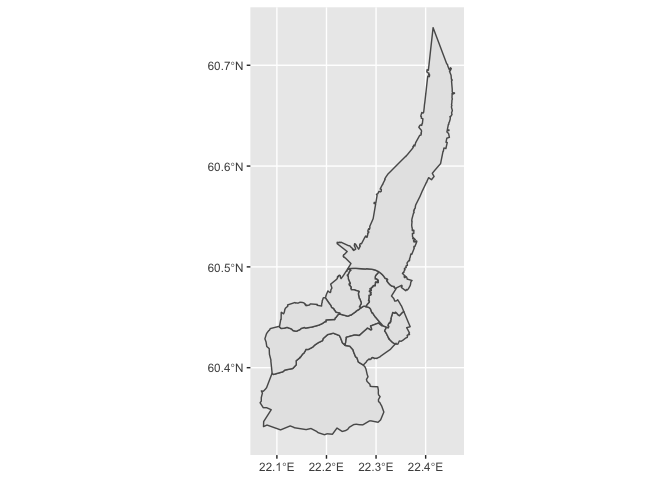
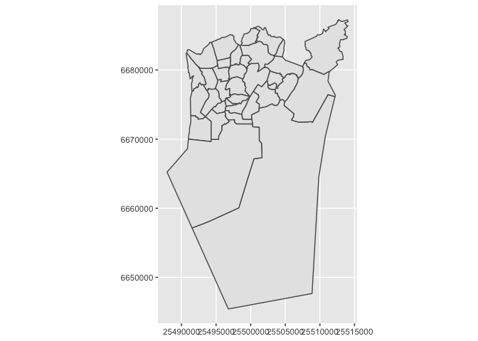

<!-- README.md is generated from README.Rmd. Please edit that file -->

# cityhoods

`cityhoods` is an R package for easy visualization of Finnish city
administrative districts. These districts can be of varying sizes:
wards, neighbourhoods, boroughs, quarters, et cetera.

## Installation

    devtools::install_github("pitkant/cityhoods")

## Usage

Currently implemented are 2 functions:

-   get\_areas: downloading maps from the server
-   visualize\_data: for easy combining of map data with statistical
    data

Included with the package are 3 datasets from the city of Turku.

    library(cityhoods)
    get_areas(city = "turku", level = 1, draw = TRUE)
    #> Reading layer `aj_palveluverkko_suuralue_20200415_area' from data source `http://dev.turku.fi/datasets/aluejaot/suuralueet-4326.geojson' using driver `GeoJSON'
    #> Simple feature collection with 9 features and 1 field
    #> geometry type:  POLYGON
    #> dimension:      XY
    #> bbox:           xmin: 22.06614 ymin: 60.33351 xmax: 22.45816 ymax: 60.73729
    #> geographic CRS: WGS 84

    get_areas(city = "helsinki", level = 2, draw = TRUE)

Function for data visualization is currently very much WIP and
experimental and works only with level 3 data from city of Turku. Since
it contains interactive menu elements it will not be reproduced in this
readme, but see and try for yourself!

    visualize_data(city = "turku", level = 3, dataset = turku_vaesto_ika_2010_2019)
